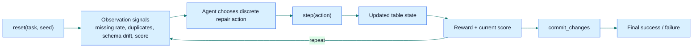
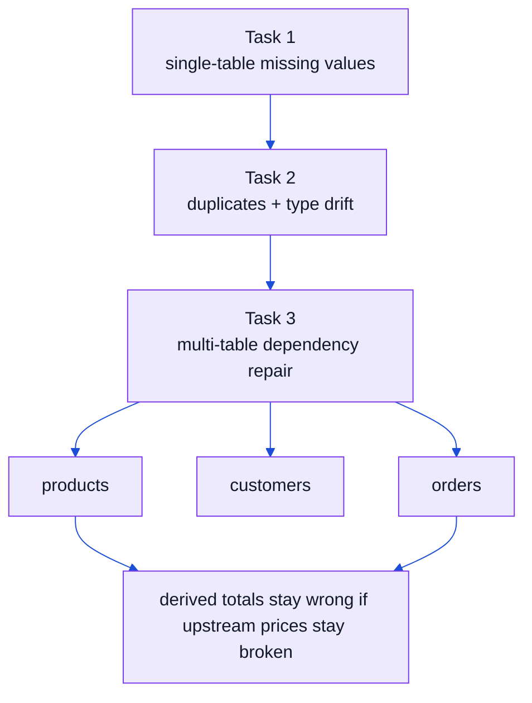

# Mario the Plumber

Mario the Plumber is an OpenEnv environment where an agent repairs broken ETL tables step by step. The environment uses a fixed discrete action space, quality-signal observations, and deterministic grading against ground truth.

## Benchmark at a Glance





## Benchmark Card

| Item | Value |
|---|---|
| Domain | ETL / data quality repair |
| API | `reset()` / `step()` / `state` |
| Tasks | 3 |
| Action space | 16 discrete repair actions |
| Scenario splits | `train`, `eval` |
| Policy modes | `random`, `heuristic`, `hybrid`, `pure-llm` |
| Success thresholds | `0.85`, `0.80`, `0.75` |
| Initial Task 3 score over 20 seeds | avg `0.2005` |
| Random Task 3 score over 20 seeds | avg `0.2065` |
| Structured Task 3 baseline | `0.9070` |
| Live Space | [`sahilksingh/mario-the-plumber`](https://huggingface.co/spaces/sahilksingh/mario-the-plumber) |

## What Changed In The New Benchmark Version

| Area | Earlier Benchmark | Current Benchmark |
|---|---|---|
| Generalization story | single fixed-seed demo | explicit `train` / `eval` splits |
| Baselines | mostly one hybrid path | `random`, `heuristic`, `hybrid`, `pure-llm` modes |
| Task 3 difficulty | random agent stayed too high | random stays near initial broken score |
| Observation design | flat error summary | table-health, dependency alerts, format issues, commit readiness |
| Reporting | one-off runs | reproducible benchmark table via `scripts/benchmark_models.py` |

## Why This Benchmark Matters

Real data systems fail in structured ways: missing values, schema drift, duplicate records, and broken derived fields. Mario the Plumber turns that into an agent benchmark where the model has to diagnose the failure, choose the right repair, and avoid damaging the table while fixing it.

This is useful because it tests a kind of work that production agents actually need to do:

- detect the source of a data quality regression
- choose repairs in the correct order
- reason over schema constraints instead of free-form text alone
- handle cross-table dependencies before committing a final fix

## Why It Is Hard

The tasks are deliberately staged so the agent cannot win by emitting generic cleanup actions:

- Task 1 requires basic missing-value repair without hurting schema validity
- Task 2 mixes duplicates with type drift, so the agent has to remove redundancy and restore the expected dtypes
- Task 3 introduces cross-table reasoning, where a premature commit can recompute bad derived values from still-broken upstream data

The environment also gives partial progress signals, which means the agent has to improve score steadily instead of relying on a binary pass/fail end state.

## What Is Implemented

- typed action, observation, and state models
- Synthetic generators for all 3 tasks
- train/eval scenario split for held-out evaluation
- Deterministic graders for single-table and multi-table scoring
- OpenEnv server environment with `reset`, `step`, and `state`
- Extra FastAPI endpoints: `/tasks`, `/grader`, and `/baseline`
- Typed client in [`client.py`](client.py)

## Tasks

1. Task 1: single table missing values
2. Task 2: single table duplicates and type violations
3. Task 3: multi-table cascading failures across `orders`, `customers`, and `products`

## What Makes It Hard

- actions are discrete, so the agent must pick the right repair instead of directly editing rows
- some fixes are only safe after earlier cleanup, like filling nulls before casting to integers
- Task 3 is cross-table: cleaning one table is not enough if downstream calculations still depend on broken inputs
- committing too early can lock in a worse overall score

## Action Model

```json
{
  "action_id": 3,
  "target_column": "age"
}
```

- `action_id` is required and must be `0-15`
- `target_column` is required for actions `3-9`, `11`, `12`
- `new_name` is required for action `12`
- `column_order` is required for action `13`
- Action `0` can optionally use `target_column` as a table switch in task 3

## Required Submission Files

This repo now uses the environment itself as the repository root. Key submission files are:

- [`inference.py`](inference.py)
- [`requirements.txt`](requirements.txt)
- [`openenv.yaml`](openenv.yaml)
- [`pyproject.toml`](pyproject.toml)
- [`uv.lock`](uv.lock)
- [`server/app.py`](server/app.py)
- [`server/Dockerfile`](server/Dockerfile)

## Local Run

```bash
python3 -m server.app
```

## Baseline

[`inference.py`](inference.py) now supports multiple policy modes:

- uses the OpenAI client for LLM calls
- reads `API_BASE_URL`, `MODEL_NAME`, and `HF_TOKEN`
- supports `heuristic`, `hybrid`, and `pure-llm` policy modes
- supports `train` and `eval` scenario splits
- records where actions came from (`llm`, `heuristic_guardrail`, `heuristic`, `auto_table_switch`)
- supports seed benchmarking with `python3 inference.py --seeds 1 2 3 4 5`

Example env setup:

```bash
export API_BASE_URL="https://router.huggingface.co/v1"
export MODEL_NAME="deepseek-ai/DeepSeek-V3-0324"
export HF_TOKEN="your-token"
python3 inference.py --policy-mode pure-llm --split eval
```

Example benchmark commands:

```bash
python3 inference.py --policy-mode heuristic --split train --seed 42
python3 inference.py --policy-mode heuristic --split eval --seed 42
python3 scripts/benchmark_models.py --policies random heuristic --splits train eval --seeds 1 2 3 --format markdown
```

Current local heuristic runs with `seed=42`:

- train split:
  - Task 1: `0.9250` in 4 steps
  - Task 2: `1.0000` in 4 steps
  - Task 3: `0.9820` in 12 steps
  - Average: `0.9690`
- eval split:
  - Task 1: `0.9250` in 5 steps
  - Task 2: `1.0000` in 5 steps
  - Task 3: `0.9820` in 13 steps
  - Average: `0.9690`

## Benchmark Results

| Policy | Split | Avg Score | Task 1 | Task 2 | Task 3 |
|---|---:|---:|---:|---:|---:|
| random | train | `0.4761` | `0.6750` | `0.5567` | `0.1968` |
| heuristic | train | `0.9370` | `0.9125` | `0.9667` | `0.9320` |
| random | eval | `0.4761` | `0.6750` | `0.5567` | `0.1968` |
| heuristic | eval | `0.9454` | `0.9125` | `0.9667` | `0.9570` |

Pure-LLM mode is implemented in [`inference.py`](inference.py), but it requires live model credentials and is not hardcoded into the checked-in benchmark table.

## Evaluation Summary

The grading logic is deterministic and score-based rather than binary-only:

- observations expose repair signals such as missing-rate, duplicate-rate, type violations, outlier count, format mismatches, dependency alerts, and per-table health summaries
- each task has a fixed success threshold
- the reward function provides partial progress and penalizes invalid or destructive actions
- Task 3 uses weighted multi-table scoring so the agent must repair the full pipeline, not just one table

Current local thresholds:

- Task 1: `0.85`
- Task 2: `0.80`
- Task 3: `0.75`

Task 3 hardening checks now show a meaningful difficulty gap:

- initial Task 3 score over 20 seeds: min `0.2001`, max `0.2037`, avg `0.2005`
- random agent on Task 3 over 20 seeds: min `0.2001`, max `0.2112`, avg `0.2065`
- structured baseline on Task 3, seed `42`: `0.9070`

## Validation

- `openenv validate`
- [`scripts/validate-submission.sh`](scripts/validate-submission.sh)
- Research-grounded benchmark review: [`docs/RL_BENCHMARK_REVIEW.md`](docs/RL_BENCHMARK_REVIEW.md)

## Evaluation Snapshot

- deterministic graders return scores in `0.0-1.0`
- success thresholds are `0.85`, `0.80`, and `0.75`
- local validation is currently passing
- the remaining high-value pre-submission check is the live HF Space validator run

## Current Local Status

- `openenv validate` passes from the repo root
- `python3 inference.py` runs all 3 official tasks with explicit split + policy controls
- `python3 scripts/benchmark_models.py` produces reproducible benchmark tables
- The deployed Hugging Face Space is live and responds to `/health` and `/reset`
- The preferred submission path is still the OpenAI-client baseline with `API_BASE_URL`, `MODEL_NAME`, and `HF_TOKEN`
- The repo now supports held-out evaluation and pure-LLM benchmarking without changing the environment API

## Known Limitations

- `drop_nulls` changes row count, so the accuracy metric strongly discourages deletion-heavy repair paths; the intended agent behavior is to prefer fill and type-repair actions over row removal.
- The provided `inference.py` is a family of baselines, not a learned RL policy. The strongest checked-in baseline is still heuristic-heavy on Task 3, while `pure-llm` mode is provided for cleaner model-only evaluation.
