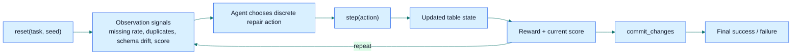
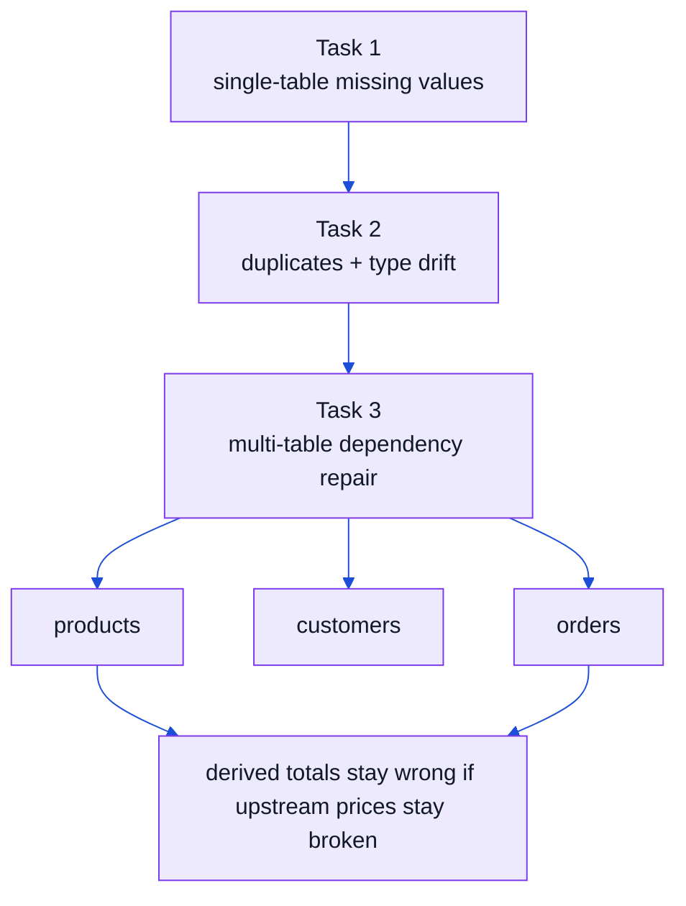
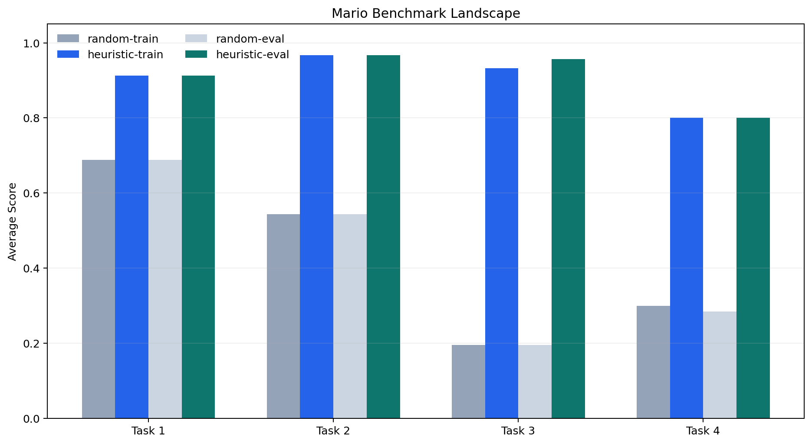
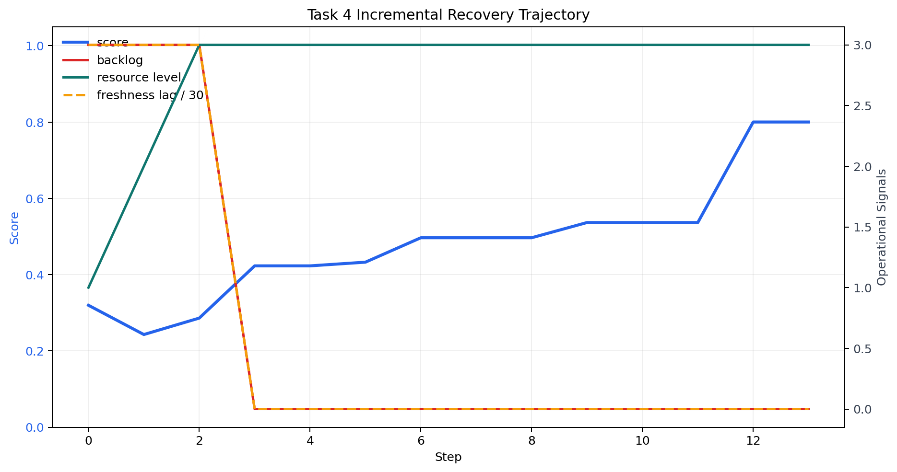

# Mario the Plumber

Mario the Plumber is an OpenEnv benchmark for **ETL repair and online pipeline recovery**. It starts with broken tables, but the harder end of the benchmark now includes workload pressure, pending incremental batches, schema drift, stale downstream aggregates, and orchestration choices around resource scaling and refresh timing.

## Benchmark at a Glance





## Benchmark Card

| Item | Value |
|---|---|
| Domain | ETL / data quality repair + online recovery |
| API | `reset()` / `step()` / `state` |
| Tasks | 5 |
| Action space | 20 discrete actions |
| Scenario splits | `train`, `eval` |
| Scenario profiles | adaptive per-task profile families |
| Policy modes | `random`, `heuristic`, `hybrid`, `pure-llm` |
| Success thresholds | `0.85`, `0.80`, `0.75`, `0.78`, `0.82` |
| Initial Task 3 score over 20 seeds | avg `0.2005` |
| Random Task 3 score over 20 seeds | avg `0.2065` |
| Structured Task 3 baseline | `0.9070` |
| Initial Task 4 score over 5 seeds | train avg `0.2489`, eval avg `0.2209` |
| Task 5 adaptation benchmark | held-out profile family avg `0.9767` |
| Live Space | [`sahilksingh/mario-the-plumber`](https://huggingface.co/spaces/sahilksingh/mario-the-plumber) |

## What Changed In The New Benchmark Version

| Area | Earlier Benchmark | Current Benchmark |
|---|---|---|
| Generalization story | single fixed-seed demo | explicit `train` / `eval` splits |
| Baselines | mostly one hybrid path | `random`, `heuristic`, `hybrid`, `pure-llm` modes |
| Task 3 difficulty | random agent stayed too high | random stays near initial broken score |
| Observation design | flat error summary | table-health, dependency alerts, format issues, commit readiness, workload signals |
| Open-world realism | mostly fixed corruption templates | adaptive profile families with alias drift, timezone drift, sentinel values, stale summaries |
| Episode semantics | single `done` flag | explicit budget/truncation signals and done reasons |
| Reward semantics | one opaque scalar | scalar reward plus reward breakdown, tradeoff weights, and subgoal progress |
| Formal task structure | implicit | Reward-Machine-style subgoal order for Tasks 3-5 |
| Reporting | one-off runs | reproducible benchmark table via `scripts/benchmark_models.py` |

## Visuals





## Why This Benchmark Matters

Real data systems fail in structured ways: missing values, schema drift, duplicate records, and broken derived fields. Mario the Plumber turns that into an agent benchmark where the model has to diagnose the failure, choose the right repair, and avoid damaging the table while fixing it.

This is useful because it tests a kind of work that production agents actually need to do:

- detect the source of a data quality regression
- choose repairs in the correct order
- reason over schema constraints instead of free-form text alone
- handle cross-table dependencies before committing a final fix
- recover a live ETL system while backlog, freshness, and resource pressure are still changing

## Open-World Failure Patterns

Mario now samples from profile families instead of only replaying one fixed corruption recipe per task. Depending on task and split, an episode can include combinations of:

- schema alias drift like `event_time -> event_ts`
- mixed timezone and datetime formatting drift
- sentinel values like `unknown` or `missing`
- delayed batches plus stale downstream tables
- unit and currency formatting drift

The environment surfaces these through:

- `scenario_profile`
- `open_world_patterns`
- `missing_expected_columns`
- `column_alias_hints`

## Episode Budget Semantics

Mario now distinguishes a terminal commit from a budget truncation:

- `done_reason = commit_success`
- `done_reason = commit_failure`
- `done_reason = quality_collapse`
- `done_reason = step_budget_exhausted`

Observations also expose:

- `time_budget_remaining`
- `time_budget_ratio`
- `truncated`

This makes the benchmark cleaner under standard RL semantics where completion and truncation should not be conflated.

## Synthetic Data Utility Story

Mario uses synthetic data as **controlled benchmark data**, not as a claim of full enterprise realism.

The utility claim is:

- schemas and dependencies are realistic enough to require meaningful repair/orchestration decisions
- random and structured policies separate clearly
- held-out `eval` profiles differ from `train` profiles
- scenario diversity can grow without exposing private production data

## Why It Is Hard

The task suite is deliberately staged so the agent cannot win by emitting generic cleanup actions:

- Task 1 requires basic missing-value repair without hurting schema validity
- Task 2 mixes duplicates with type drift, so the agent has to remove redundancy and restore the expected dtypes
- Task 3 introduces cross-table reasoning, where a premature commit can recompute bad derived values from still-broken upstream data
- Task 4 adds incremental recovery, where the agent must scale resources, ingest delayed batches, normalize schema drift, refresh downstream aggregates, and only then commit
- Task 5 adds temporal/compositional recovery, where the agent must satisfy a formal sequence of subgoals before a final commit is safe

The environment also gives partial progress signals, which means the agent has to improve score steadily instead of relying on a binary pass/fail end state.

## What Is Implemented

- typed action, observation, and state models
- Synthetic generators for all 5 tasks
- train/eval scenario split for held-out evaluation
- adaptive scenario profiles with open-world drift families
- Deterministic graders for single-table and multi-table scoring
- Task 4 orchestration features for backlog, freshness lag, and resource pressure
- Reward-machine-style task structure for Tasks 3-5 via subgoal progress and automaton state
- Tradeoff weights and objective breakdowns exposed in observations for Tasks 3-5
- OpenEnv server environment with `reset`, `step`, and `state`
- Extra FastAPI endpoints: `/tasks`, `/grader`, `/baseline`, and `/benchmark-metadata`
- Typed client in [`client.py`](client.py)

## Task Suite

1. Task 1: single table missing values
2. Task 2: single table duplicates and type violations
3. Task 3: multi-table cascading failures across `orders`, `customers`, and `products`
4. Task 4: incremental ETL recovery across `orders`, `products`, and `daily_summary`
5. Task 5: temporal ETL recovery across `source_orders`, `catalog`, and `hourly_rollup`

## What Makes It Hard

- actions are discrete, so the agent must pick the right repair or orchestration move instead of directly editing rows
- some fixes are only safe after earlier cleanup, like filling nulls before casting to integers
- Task 3 is cross-table: cleaning one table is not enough if downstream calculations still depend on broken inputs
- Task 4 is operational: over time the agent must reason about backlog, freshness, resource level, and stale downstream state
- Task 5 is compositional: the benchmark exposes an explicit subgoal sequence and requires temporal rollup repair plus SLA recovery before commit
- committing too early can lock in a worse overall score

## Action Model

```json
{
  "action_id": 3,
  "target_column": "age"
}
```

- `action_id` is required and must be `0-19`
- `target_column` is required for actions `3-9`, `11`, `12`
- `new_name` is required for action `12`
- `column_order` is required for action `13`
- Action `0` can optionally use `target_column` as a table switch in task 3 and task 4
- Task 4 adds orchestration actions:
  - `16`: `scale_resources_up`
  - `17`: `scale_resources_down`
  - `18`: `prioritize_incremental_batch`
  - `19`: `refresh_downstream_summary`
- Tasks 3-5 also expose:
  - `reward_breakdown`
  - `objective_breakdown`
  - `tradeoff_weights`
  - `subgoal_progress`
  - `reward_machine_state`

## Required Submission Files

This repo now uses the environment itself as the repository root. Key submission files are:

- [`inference.py`](inference.py)
- [`requirements.txt`](requirements.txt)
- [`openenv.yaml`](openenv.yaml)
- [`pyproject.toml`](pyproject.toml)
- [`uv.lock`](uv.lock)
- [`server/app.py`](server/app.py)
- [`server/Dockerfile`](server/Dockerfile)

## Local Run

```bash
python3 -m server.app
```

## Baseline

[`inference.py`](inference.py) now supports multiple policy modes:

- uses the OpenAI client for LLM calls
- reads `API_BASE_URL`, `MODEL_NAME`, and `HF_TOKEN`
- supports `heuristic`, `hybrid`, and `pure-llm` policy modes
- supports `train` and `eval` scenario splits
- handles alias-drift repair candidates via `rename_column`
- records where actions came from (`llm`, `heuristic_guardrail`, `heuristic`, `auto_table_switch`)
- supports seed benchmarking with `python3 inference.py --seeds 1 2 3 4 5`

Example env setup:

```bash
export API_BASE_URL="https://router.huggingface.co/v1"
export MODEL_NAME="deepseek-ai/DeepSeek-V3-0324"
export HF_TOKEN="your-token"
python3 inference.py --policy-mode pure-llm --split eval
```

Example benchmark commands:

```bash
python3 inference.py --policy-mode heuristic --split train --seed 42
python3 inference.py --policy-mode heuristic --split eval --seed 42
python3 scripts/benchmark_models.py --policies random heuristic --splits train eval --seeds 1 2 3 --format markdown
```

Current local heuristic runs with `seed=42`:

- train split:
  - Task 1: `0.9250` in 4 steps
  - Task 2: `1.0000` in 4 steps
  - Task 3: `0.9820` in 12 steps
  - Task 4: `0.8000` in 14 steps
  - Task 5: `0.9789` in 10 steps
  - Average: `0.9362`
- eval split:
  - Task 1: `0.8875` in 5 steps
  - Task 2: `1.0000` in 5 steps
  - Task 3: `0.9520` in 15 steps
  - Task 4: `0.7925` in 16 steps
  - Task 5: `0.9789` in 10 steps
  - Average: `0.9089`

## Benchmark Results

| Policy | Split | Avg Score | Task 1 | Task 2 | Task 3 | Task 4 | Task 5 |
|---|---:|---:|---:|---:|---:|---:|---:|
| random | train | `0.4351` | `0.6512` | `0.5425` | `0.1900` | `0.3915` | `0.4003` |
| heuristic | train | `0.9169` | `0.9250` | `0.9750` | `0.9055` | `0.8000` | `0.9789` |
| random | eval | `0.4165` | `0.6659` | `0.5425` | `0.1931` | `0.3012` | `0.3800` |
| heuristic | eval | `0.9089` | `0.9062` | `0.9750` | `0.8920` | `0.7925` | `0.9789` |

Strict `pure-llm` mode is implemented in [`inference.py`](inference.py). It now disables heuristic rescue so model-only evaluation is honest, but it should be re-benchmarked after the Task 4 upgrade with your preferred live model credentials.

## Evaluation Summary

The grading logic is deterministic and score-based rather than binary-only:

- observations expose repair signals such as missing-rate, duplicate-rate, type violations, outlier count, format mismatches, dependency alerts, per-table health summaries, backlog rows, freshness lag, workload pressure, and resource requirements
- observations now also expose scenario-profile metadata, alias hints, open-world pattern tags, time-budget semantics, structured reward breakdowns, tradeoff weights, and reward-machine state
- each task has a fixed success threshold
- the reward function provides partial progress and penalizes invalid or destructive actions
- Task 3 uses weighted multi-table scoring so the agent must repair the full pipeline, not just one table
- Tasks 3-5 expose explicit subgoal progress so multi-step repair is easier to audit and benchmark

Current local thresholds:

- Task 1: `0.85`
- Task 2: `0.80`
- Task 3: `0.75`
- Task 4: `0.78`
- Task 5: `0.82`

Task 3 hardening checks now show a meaningful difficulty gap:

- initial Task 3 score over 20 seeds: min `0.2001`, max `0.2037`, avg `0.2005`
- random agent on Task 3 over 20 seeds: min `0.2001`, max `0.2112`, avg `0.2065`
- structured baseline on Task 3, seed `42`: `0.9070`

Task 4 checks show the online recovery setting is meaningfully harder than static repair:

- initial Task 4 score over 5 seeds: train avg `0.2489`, eval avg `0.2209`
- random Task 4 benchmark score: train `0.3399`, eval `0.2639`
- structured Task 4 baseline, seed `42`: `0.8000`

Task 5 checks now show direct one-shot adaptation to unseen temporal profile families:

- heuristic Task 5, train split over seeds `1-6`: avg `0.9774`
- heuristic Task 5, eval split over seeds `1-6`: avg `0.9774`
- held-out Task 5 eval profile family over seeds `2,3`: avg `0.9767`
- adaptation report: `python3 scripts/benchmark_adaptation.py --policy-mode heuristic --seeds 1 2 3 4 5 6`

## Validation

- `openenv validate`
- [`scripts/validate-submission.sh`](scripts/validate-submission.sh)
- `python3 scripts/export_benchmark_metadata.py`
- `python3 scripts/benchmark_adaptation.py --policy-mode heuristic --seeds 1 2 3 4 5 6`
- Research-grounded benchmark review: [`docs/RL_BENCHMARK_REVIEW.md`](docs/RL_BENCHMARK_REVIEW.md)

## Evaluation Snapshot

- deterministic graders return scores in `0.0-1.0`
- success thresholds are `0.85`, `0.80`, `0.75`, `0.78`, and `0.82`
- local validation is currently passing
- the remaining high-value pre-submission check is the live HF Space validator run

## Current Local Status

- `openenv validate` passes from the repo root
- `python3 inference.py` now runs all 5 benchmark tasks with explicit split + policy controls
- `python3 scripts/benchmark_models.py` produces reproducible benchmark tables
- `python3 scripts/benchmark_adaptation.py` reports held-out temporal-profile adaptation on Task 5
- `docs/assets/benchmark_runs.json`, `docs/assets/benchmark_runs.csv`, and `docs/assets/benchmark_metadata.json` are generated benchmark artifacts
- The deployed Hugging Face Space is live and responds to `/health` and `/reset`
- The preferred submission path is still the OpenAI-client baseline with `API_BASE_URL`, `MODEL_NAME`, and `HF_TOKEN`
- The repo now supports held-out evaluation, orchestration-heavy Task 4 recovery, Task 5 temporal recovery with formal subgoal structure, adaptive open-world profiles, and strict pure-LLM benchmarking without changing the environment API

## Known Limitations

- `drop_nulls` changes row count, so the accuracy metric strongly discourages deletion-heavy repair paths; the intended agent behavior is to prefer fill and type-repair actions over row removal.
- The provided `inference.py` is a family of baselines, not a learned RL policy. `pure-llm` mode is now strict and does not borrow heuristic rescue, so its lower score should be read as a cleaner model-only benchmark rather than a submission-optimized baseline.
- Task 4 currently models one style of online ETL recovery. Future extensions should vary workload bursts during the episode rather than only at reset time.
- Task 5 currently encodes formal progress through an explicit subgoal sequence, but it is still a hand-authored reward machine rather than a learned task specification.

## Additional Docs

- [Research-grounded benchmark review](docs/RL_BENCHMARK_REVIEW.md)
- [Adaptive ETL upgrade notes](docs/ADAPTIVE_ETL_UPGRADE.md)
- [Open-world benchmark notes](docs/OPEN_WORLD_BENCHMARK_NOTES.md)
- [Reward structure and adaptation notes](docs/REWARD_STRUCTURE_AND_ADAPTATION.md)
- [What the papers imply we should build next](docs/NEXT_STEPS_FROM_PAPERS.md)
