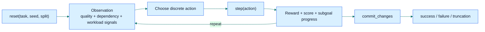

# Mario the Plumber

Mario the Plumber is an **ELT/ETL pipeline incident fixer** delivered through OpenEnv. Agents diagnose broken ingestion and recovery states, repair upstream tables, restore downstream freshness, and decide when a pipeline is safe to commit.

## Benchmark Card

| Item | Value |
|---|---|
| Domain | ETL incident diagnosis, repair, and safe recovery |
| API | `reset()` / `step()` / `state` |
| Tasks | `5` |
| Actions | `20` discrete actions |
| Splits | `train`, `eval` |
| Runtime framings | `benchmark`, `incident`, `hybrid` |
| Hard tasks | Task 3, Task 4, Task 5 |
| Structured signals | reward breakdown, tradeoff weights, subgoal progress, reward-machine state |
| Live Space | [sahilksingh/mario-the-plumber](https://huggingface.co/spaces/sahilksingh/mario-the-plumber) |

## Quick Start

Run the server:

```bash
python3 -m server.app
```

Validate the environment:

```bash
openenv validate
```

Run the regression suite:

```bash
python3 -m venv .venv
./.venv/bin/pip install -r requirements.txt pytest
./.venv/bin/python -m pytest tests -q
```

Run the baseline:

```bash
python3 -m inference --policy-mode heuristic --split eval --seed 42
```

The inference CLI emits strict `START` / `STEP` / `END` protocol lines by default for submission parsers.
If you need legacy single-JSON output, add:

```bash
python3 -m inference --policy-mode heuristic --split eval --seed 42 --stdout-protocol json
```

## Environment Loop



## Recovery Proof

Current local sweep from [scripts/benchmark_models.py](scripts/benchmark_models.py) over seeds `1 2`:

| Policy | Split | Avg Score | Task 1 | Task 2 | Task 3 | Task 4 | Task 5 |
|---|---:|---:|---:|---:|---:|---:|---:|
| random | train | `0.4915` | `0.6459` | `0.5425` | `0.4743` | `0.5108` | `0.2839` |
| heuristic | train | `0.9464` | `0.9062` | `0.9750` | `0.9610` | `0.9100` | `0.9795` |
| random | eval | `0.4809` | `0.6659` | `0.5225` | `0.5131` | `0.4549` | `0.2480` |
| heuristic | eval | `0.8362` | `0.9062` | `0.9750` | `0.7945` | `0.7647` | `0.7407` |

Held-out adaptation from [scripts/benchmark_adaptation.py](scripts/benchmark_adaptation.py):

- Task 3 train mean: `0.9536`
- Task 3 eval mean: `0.8331`
- Task 3 familiar eval mean: `0.9437`
- Task 3 held-out profile family mean: `0.7225`
- Task 3 held-out family gap: `0.2311`

- Task 4 train mean: `0.9100`
- Task 4 eval mean: `0.7706`
- Task 4 familiar eval mean: `0.9100`
- Task 4 held-out profile family mean: `0.6312`
- Task 4 held-out family gap: `0.2788`

- Task 5 train mean: `0.9795`
- Task 5 eval mean: `0.7509`
- Task 5 familiar eval mean: `0.9795`
- Task 5 held-out profile family mean: `0.5222`
- Task 5 held-out family gap: `0.4573`
- Task 5 held-out profile breakdown:
  - `heldout_temporal_schema_extension_family`: `0.4918`
  - `heldout_temporal_rollup_contract_family`: `0.5466`
  - `heldout_temporal_correction_replay_family`: `0.5181`

The suite is designed so that realistic ETL incidents stay well above random behavior but remain solvable by structured recovery policies. Tasks 3-5 now expose explicit held-out recovery families. Task 3 tests unfamiliar referential-repair variants, Task 4 separates familiar orchestration from unseen incremental recovery shapes, and Task 5 still carries the strongest temporal adaptation pressure.

## Benchmark Visuals

Benchmark visuals are generated locally with `python3 -m scripts.generate_submission_artifacts` and are intentionally not tracked in the repository.

## Tasks

| Task | Difficulty | Incident Type | Tables |
|---|---|---|---|
| 1 | Easy | first-line ingestion repair | `single` |
| 2 | Medium | validation and event stabilization | `single` |
| 3 | Hard | referential repair and cascading recovery | `orders`, `customers`, `products` |
| 4 | Hard | on-call incremental recovery under backlog, freshness, and resource pressure | `orders`, `products`, `daily_summary` |
| 5 | Hard | temporal rollup recovery with schema evolution and late corrections | `source_orders`, `catalog`, `hourly_rollup` |

Each task now exposes an explicit ETL incident card with:

- what broke
- diagnosis signals
- recovery requirements
- unsafe commit conditions
- threshold rationale

## Observation and Actions

Observations expose:

- incident framing: `incident_type`, `incident_summary`, `diagnosis_signals`, `recovery_requirements`, `unsafe_commit_conditions`
- quality signals: `missing_rate`, `duplicate_rate`, `type_violations`, `outlier_count`, `format_issues`
- dependency and table signals: `table_health`, `dependency_alerts`, `commit_ready`
- orchestration signals: `backlog_rows`, `queue_backlog_age_minutes`, `freshness_lag_minutes`, `sla_severity`, `resource_level`, `required_resource_level`, `pending_batches`
- operational incident signals: `recent_failure_counters`, `drift_markers`, `dependency_health_summary`
- open-world signals: `scenario_profile`, `open_world_patterns`, `missing_expected_columns`, `column_alias_hints`
- episode semantics: `time_budget_remaining`, `truncated`, `done_reason`
- structured task signals for Tasks 3-5:
  - `reward_breakdown`
  - `objective_breakdown`
  - `tradeoff_weights`
  - `subgoal_progress`
  - `reward_machine_state`

Actions:

- `0`: inspect schema / switch table on multi-table tasks
- `3-5`: fill values
- `6`: drop null rows
- `7-9`: cast or normalize columns
- `10`: remove duplicates
- `11`: drop outliers
- `12`: rename column
- `13`: reorder columns
- `14`: validate schema
- `15`: commit changes
- `16-19`: ETL-native orchestration controls for worker scaling, replaying the priority batch, and refreshing downstream assets

## Space Demo

The Hugging Face Space serves the standard OpenEnv API and, when the web interface is enabled, a benchmark-specific visualization tab at `/web`:

- ETL incident overview
- incident/task explorer
- live diagnosis and recovery inspector
- benchmark results and adaptation artifacts
- architecture notes for reviewers

## Reward and Evaluation

Mario keeps a scalar OpenEnv reward, but the ETL recovery logic is now more explicit:

- Tasks 1-2 use the single-table mix: completeness, validity, consistency, accuracy
- Tasks 3-5 expose higher-level pipeline objective weights alongside the scalar score
- task cards distinguish **true recovery success** from **dense shaping terms**
- exploit checks explicitly guard against deletion-heavy repair, premature commit, cosmetic consistency, and fake recovery through resource overuse

- `reward_breakdown`
- `objective_breakdown`
- `tradeoff_weights`
- `subgoal_progress`
- `subgoal_order`
- `active_subgoal`
- `reward_machine_state`

These signals make the ETL incident fixer easier to audit without changing the standard OpenEnv API.

## Artifact Generation

Generate benchmark artifacts:

```bash
python3 -m scripts.train_trained_policy --seeds 1 2 3 4 5 6 7 8 9 10
python3 -m scripts.benchmark_models --policies random heuristic --splits train eval --seeds 1 2 --format markdown
python3 -m scripts.benchmark_adaptation --policy-mode heuristic --seeds 1 2 3 4 5 6
python3 -m scripts.export_benchmark_metadata --seeds 1 2 3 4 5 6 --output docs/assets/benchmark_metadata.json
python3 -m scripts.generate_visuals
./scripts/validate-live-space.sh https://sahilksingh-mario-the-plumber.hf.space
```

Benchmark outputs and visuals are generated on demand for release/submission. Use:

```bash
python3 -m scripts.generate_submission_artifacts
```

The demo and benchmark routes degrade gracefully when generated assets are absent.

## CI

GitHub Actions validates:

- `ruff check .`
- `pytest tests -q`
- `openenv validate`
- `docker build -f server/Dockerfile .`

## Baseline Modes

[inference.py](inference.py) supports:

- `heuristic`
- `trained`
- `hybrid`
- `pure-llm`

`pure-llm` is strict and does not silently borrow heuristic rescue.

Benchmark artifacts also report:

- action-source mix
- held-out profile-family behavior
- incident-family coverage
- generalization gaps between `train` and `eval`

## Deployment

Key submission files:

- [inference.py](inference.py)
- [openenv.yaml](openenv.yaml)
- [pyproject.toml](pyproject.toml)
- [requirements.txt](requirements.txt)
- [server/app.py](server/app.py)
- [server/Dockerfile](server/Dockerfile)

## Project Structure

- [server/pipeline_doctor_environment.py](server/pipeline_doctor_environment.py): environment lifecycle and episode orchestration
- [server/data_generator.py](server/data_generator.py): scenario dispatch into fixture-backed task generators
- [server/incidents](server/incidents): trace-grounded incident fixtures and manifests for harder tasks
- [benchmark/grading.py](benchmark/grading.py): deterministic scoring and reward shaping
- [benchmark/evaluation.py](benchmark/evaluation.py): score dispatch and episode summaries
- [benchmark/progress.py](benchmark/progress.py): subgoal progression and recovery state
- [benchmark/task_runtime](benchmark/task_runtime): task-specific runtime progression, dependency health, and runtime diagnostics
- [benchmark/actions](benchmark/actions): repair handlers, orchestration handlers, and commit gating
- [benchmark/policies/engine.py](benchmark/policies/engine.py): baseline policy orchestration
- [server/benchmark_demo.py](server/benchmark_demo.py): custom web demo
- [server/app.py](server/app.py): OpenEnv app wiring and benchmark routes

## Known Limitations

- `drop_nulls` changes row count, so the accuracy metric strongly discourages deletion-heavy repairs.
- `inference.py` is a benchmark baseline family, not a learned RL policy.
- Task 5 uses a hand-authored formal subgoal structure rather than a learned task specification.
- Mario is trace-grounded and self-contained, but it is still a benchmark abstraction rather than a live warehouse or scheduler integration.

## Additional Docs

- [Benchmark architecture](docs/BENCHMARK_ARCHITECTURE.md)
- [Reward and adaptation](docs/REWARD_STRUCTURE_AND_ADAPTATION.md)
