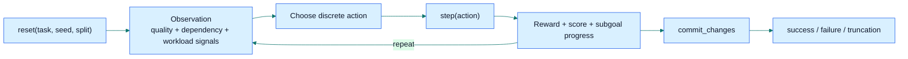
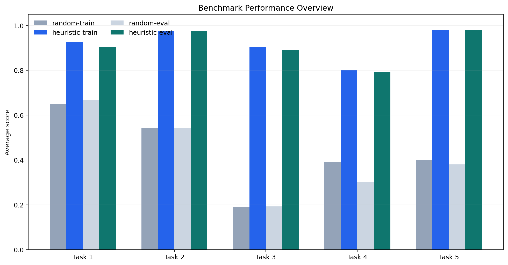
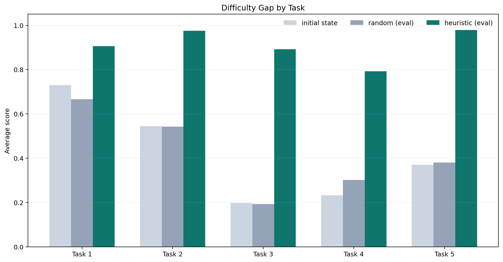
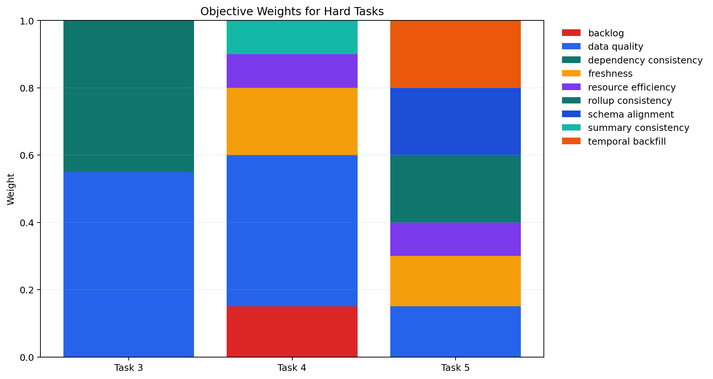

# Mario the Plumber

Mario the Plumber is an OpenEnv benchmark for **ETL repair, online recovery, and temporal pipeline orchestration**. Agents interact through a discrete action space and must improve data quality, dependency consistency, freshness, backlog state, and safe commit timing.

## Benchmark Card

| Item | Value |
|---|---|
| Domain | ETL repair + online pipeline recovery |
| API | `reset()` / `step()` / `state` |
| Tasks | `5` |
| Actions | `20` discrete actions |
| Splits | `train`, `eval` |
| Hard tasks | Task 3, Task 4, Task 5 |
| Structured signals | reward breakdown, tradeoff weights, subgoal progress, reward-machine state |
| Live Space | [sahilksingh/mario-the-plumber](https://huggingface.co/spaces/sahilksingh/mario-the-plumber) |

## Environment Loop



## Results Overview



The benchmark separates weak and structured policies clearly. On the current local sweep over seeds `1 2`, heuristic policies stay around `0.91`, while random policies stay around `0.42`.

## Difficulty Structure



This chart compares:

- the initial broken state
- random behavior on `eval`
- structured heuristic behavior on `eval`

The hard tasks now show the intended benchmark gap:

- Task 3: initial ~ `0.20`, random ~ `0.19`, heuristic ~ `0.89`
- Task 4: initial ~ `0.23`, random ~ `0.30`, heuristic ~ `0.79`
- Task 5: initial ~ `0.36`, random ~ `0.38`, heuristic ~ `0.98`

## Grading Structure



Tasks 3-5 still return a scalar OpenEnv reward, but the benchmark now also exposes structured grading signals:

- `reward_breakdown`
- `objective_breakdown`
- `tradeoff_weights`
- `subgoal_progress`
- `subgoal_order`
- `active_subgoal`
- `reward_machine_state`

This makes the reward system more interpretable without breaking the hackathon API contract.

## Task Suite

| Task | Difficulty | Focus | Tables |
|---|---|---|---|
| 1 | Easy | missing values + format cleanup | `single` |
| 2 | Medium | duplicates + dtype repair | `single` |
| 3 | Hard | cross-table dependency repair | `orders`, `customers`, `products` |
| 4 | Hard | online ETL recovery under backlog, freshness, and resource pressure | `orders`, `products`, `daily_summary` |
| 5 | Hard | temporal recovery with formal subgoal structure | `source_orders`, `catalog`, `hourly_rollup` |

## Observation Design

Observations expose:

- quality signals: `missing_rate`, `duplicate_rate`, `type_violations`, `outlier_count`, `format_issues`
- dependency and table signals: `table_health`, `dependency_alerts`, `commit_ready`
- orchestration signals: `backlog_rows`, `freshness_lag_minutes`, `resource_level`, `required_resource_level`, `pending_batches`
- open-world signals: `scenario_profile`, `open_world_patterns`, `missing_expected_columns`, `column_alias_hints`
- episode semantics: `time_budget_remaining`, `truncated`, `done_reason`
- structured benchmark signals for Tasks 3-5:
  - `reward_breakdown`
  - `objective_breakdown`
  - `tradeoff_weights`
  - `subgoal_progress`
  - `reward_machine_state`

## Action Space

Core repair actions:

- `0`: inspect schema / switch table on multi-table tasks
- `3-5`: fill values
- `6`: drop nulls
- `7-9`: cast or normalize columns
- `10`: remove duplicates
- `11`: drop outliers
- `12`: rename column
- `13`: reorder columns
- `14`: validate schema
- `15`: commit changes

Orchestration actions:

- `16`: scale resources up
- `17`: scale resources down
- `18`: prioritize incremental batch
- `19`: refresh downstream summary or temporal rollup

## Formal Task Structure

Mario now uses Reward-Machine-style subgoal ordering for the harder tasks.

Task 3:
- repair customers
- repair products
- repair orders
- restore dependency consistency
- commit pipeline

Task 4:
- normalize orders stream
- scale resources if needed
- load incremental backlog
- refresh daily summary
- commit recovery

Task 5:
- reconcile schema aliases
- repair catalog and source quality
- replay late batches
- refresh temporal rollup
- meet freshness SLA
- commit temporal pipeline

## Benchmark Results

Current local sweep from [scripts/benchmark_models.py](scripts/benchmark_models.py) over seeds `1 2`:

| Policy | Split | Avg Score | Task 1 | Task 2 | Task 3 | Task 4 | Task 5 |
|---|---:|---:|---:|---:|---:|---:|---:|
| random | train | `0.4351` | `0.6512` | `0.5425` | `0.1900` | `0.3915` | `0.4003` |
| heuristic | train | `0.9169` | `0.9250` | `0.9750` | `0.9055` | `0.8000` | `0.9789` |
| random | eval | `0.4165` | `0.6659` | `0.5425` | `0.1931` | `0.3012` | `0.3800` |
| heuristic | eval | `0.9089` | `0.9062` | `0.9750` | `0.8920` | `0.7925` | `0.9789` |

Held-out Task 5 adaptation from [scripts/benchmark_adaptation.py](scripts/benchmark_adaptation.py):

- train mean: `0.9774`
- eval mean: `0.9774`
- held-out profile family mean: `0.9767`

## Running Locally

Start the server:

```bash
python3 -m server.app
```

Validate the environment:

```bash
openenv validate
```

Run the baseline:

```bash
python3 inference.py --policy-mode heuristic --split train --seed 42
python3 inference.py --policy-mode heuristic --split eval --seed 42
```

Generate benchmark artifacts:

```bash
python3 scripts/benchmark_models.py --policies random heuristic --splits train eval --seeds 1 2 --format markdown
python3 scripts/benchmark_adaptation.py --policy-mode heuristic --seeds 1 2 3 4 5 6
python3 scripts/export_benchmark_metadata.py --seeds 1 2 3 4 5 6 --output docs/assets/benchmark_metadata.json
python3 scripts/generate_visuals.py
```

## Baseline Modes

[inference.py](inference.py) supports:

- `heuristic`
- `hybrid`
- `pure-llm`

`pure-llm` is strict and does not silently borrow heuristic rescue.

## Deployment

Key submission files:

- [inference.py](inference.py)
- [openenv.yaml](openenv.yaml)
- [pyproject.toml](pyproject.toml)
- [requirements.txt](requirements.txt)
- [server/app.py](server/app.py)
- [server/Dockerfile](server/Dockerfile)

## Known Limitations

- `drop_nulls` changes row count, so the accuracy metric strongly discourages deletion-heavy repairs.
- `inference.py` is a benchmark baseline family, not a learned RL policy.
- Task 5 uses a hand-authored formal subgoal structure; it is more serious than before, but still not a learned task specification.

## Additional Docs

- [Reward structure and adaptation notes](docs/REWARD_STRUCTURE_AND_ADAPTATION.md)
- [Open-world benchmark notes](docs/OPEN_WORLD_BENCHMARK_NOTES.md)
- [Adaptive ETL upgrade notes](docs/ADAPTIVE_ETL_UPGRADE.md)
- [Research-grounded benchmark review](docs/RL_BENCHMARK_REVIEW.md)
- [What the papers imply we should build next](docs/NEXT_STEPS_FROM_PAPERS.md)
